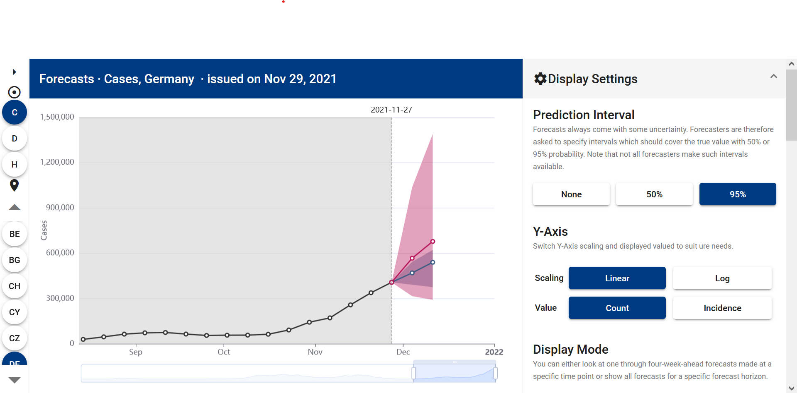
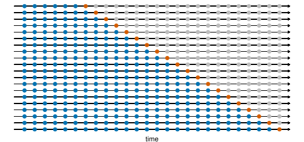

<!-- here classes for second slide -->

```{r, child="xaringan-setup.Rmd", echo=FALSE}

```

```{r, include=FALSE}
devtools::load_all(".")

library(scoringutils)
library(dplyr)
library(DT)

df <- read.csv(here::here("data", "full-data-uk-challenge.csv"))
df_subset <- slice_sample(df, n = 50)
```

<!-- here content of second slide -->

## Motivation:<br>UK Covid-19 Crowd Forecasting Challenge

.footnote[ 
https://www.crowdforecastr.org/2021/05/11/uk-challenge/ <br>
https://epiforecasts.io/uk-challenge/
]

- Predict Number of Covid-19 Cases and Deaths for the next 4 weeks in the United Kingdom

--

- Submission of weekly predictions via an interactive web application

--

- Part of ongoing research project by the **epiforecasts** group of the London School of Hygiene & Tropical Medicine that our project partner Nikos Bosse is actively part of due to his PHD in Epidemiology

---

## Motivation:<br>UK Covid-19 Crowd Forecasting Challenge

.footnote[ 
https://www.crowdforecastr.org/2021/05/11/uk-challenge/ <br>
https://epiforecasts.io/uk-challenge/
]

- Idea: Compare forecasts from humans with model-based predictions

--

- Empirically human forecasts are surprisingly competitive and in some cases even better than statistical models 

--

- This is mostly true for **point** forecasts, prediction **intervals** are often chosen too narrow, i.e. humans tend to be too confident in their own predictions

--

- Goal: Use valuable information from point forecasts and adjust prediction intervals / quantile forecasts with an appropriate correction procedure  

---

## Motivation:<br>UK Covid-19 Crowd Forecasting Challenge

.size-80[

```{r, echo=FALSE}
df_subset |>
  select(-target) |>
  datatable(
    rownames = FALSE,
    filter = "top",
    fillContainer = FALSE,
    options = list(
      scrollX = TRUE,
      pageLength = 4,
      autoWidth = TRUE
    )
  )
```

]

---

## European Forecast Hub

.footnote[https://covid19forecasthub.eu/index.html]

.left-column.size-80[

<br>
<br>

- UK Data only contains few observations over time span of 13 weeks

- European Forecast Hub provides data with forecasts from international research groups for many European Countries over a longer time horizon

] 

.right-column[
 
<!--    -->
]


---
class: inverse, center, middle

# Post Processing 

---

## Idea

- Adjust Forecasts based on performance metrics on out-of-sample data

--

-  Split in 3 separate data sets:

    - **Training:** Build Forecast Model to make quantile predictions
    - **Validation:** Use predictions to determine potential hyperparameters of post-processing method
    - **Test:** Evaluate Adjusted Predictions compared to original predictions
  
--
    
- In our case the data already contains quantile predictions such that step 1 is not required

--

- **Important:** We do **not** build a prediction model ourselves. <br>
Instead we take existing predictions as input and output adjusted / processed forecasts.

---

## Methods

Many post-processing methods available, including

--

- **Conformalized Quantile Regression**: <br>
  Focus of Today

--

- **Quantile Regression Averaging**: <br>
  For given quantile level $\alpha$, new prediction is a weighted average of multiple existing predictions from different models. 
    The individual contributions, i.e. the weights, are chosen to minimize a chosen loss function.
    
--

- **Quantile Spread Adjustment**: <br>
  Assumes multiplicative relationship between quantile levels, e.g. $q_{0.9} = \lambda_{0.9} \cdot q_{0.8} = \lambda_{0.8} \cdot q_{0.8}$ with potentially different factors $\lambda_{\alpha}$. <br>
  Too conservative quantile predictions can thus be corrected by choosing larger multiplicative factors in the tails of the predictive distribution. 

--

- More detailed overview given in **README** Page of Project's GitHub Repository<sup>1</sup>

.footnote[[1] https://github.com/nikosbosse/post-processing-forecasts]

---


## Evaluation

- Based on **Weighted Interval Score**<sup>1</sup> 

.center.bold[WIS = Sharpness + Underprediction + Overprediction]

.footnote[[1] https://journals.plos.org/ploscompbiol/article?id=10.1371/journal.pcbi.1008618]

--

- For a given quantile level $\alpha$ and observed value $y$, the score is computed as

$$
Score_\alpha(y) = (u-l) + \frac{2}{\alpha} \cdot (l-y) \cdot \mathbf{1} (y \leq l) + \frac{2}{\alpha} \cdot (y-u) \cdot \mathbf{1}(y \geq u)
$$

--

- The Score of the entire model can be obtained from a weighted average over all (included) quantile levels $\alpha$  

--

- Implemented in the .mono[**eval_forecasts()**] function of the .mono[**scoringutils**] R package written by Nikos

---
class: inverse, middle, center

# Conformalized Quantile Regression

---

## Conformalized Quantile Regression

Theory based on Paper Romano Y., Patterson E., and Candès E. (2019): *Conformalized Quantile Regression*

**Central Theorem:** 

If $(X_i, Y_i), i = 1, \ldots, n+1$ are exchangeable, then the prediction interval $C(X_{n+1})$ constructed by the CQR algorithm satisfies
  
$$
\begin{aligned}
P \left(Y_{n+1} \in C(X_{n+1}) \right) \geq 1 - \alpha \quad \text{(coverage)}.
\end{aligned}
$$
Moreover, if the conformity scores $E_i$ are almost surely distinct, then the prediction interval is nearly perfectly calibrated:

$$
\begin{aligned}
P \left( Y_{n+1} \in C(X_{n+1}) \right) \leq 1 - \alpha + \frac{ 1}{ \left| I_2 \right| + 1} \quad \text{(precision)}.
\end{aligned}
$$

---

## CQR Algorithm

**Step 1:** <br>
Split the data into a training and validation (here called *calibration*) set, indexed by $I_1$ and $I_2$, respectively

--

**Step 2:** <br>
For a given quantile $\alpha$ and a given quantile regression algorithm $\mathcal{A}$, calculate lower and upper interval bounds on the training set:

$$
\begin{aligned}
\left\{ \hat{ q}_{\alpha, \, low}, \; \hat{ q}_{\alpha, \, high} \right\} \leftarrow \mathcal{A} \left( \left\{ (X_i, Y_i): i \in I_1 \right\} \right) 
\end{aligned}
$$

---

## CQR Algorithm

**Step 3:** <br>
Compute **conformity scores** on the calibration set:

$$
\begin{aligned}
E_i := \operatorname*{max} \left\{ \hat{ q}_{\alpha, \, low}(X_i) - Y_i, \; Y_i - \hat{ q}_{\alpha, \, high}(X_i) \right\} \quad \forall \; i \in I_2
\end{aligned}
$$

For each $i$, the corresponding score $E_i$ is positive if $Y_i$ is *outside* the interval $\left[ \hat{ q}_{\alpha, \, low}(X_i), \; \hat{ q}_{\alpha, \, high}(X_i) \right]$ and negative if $Y_i$ is *inside* the interval.

--

**Step 4:** <br>
Compute the **margin** $Q_{1 - \alpha}(E, I_2)$ given by the $(1 - \alpha)(1 + \frac{ 1}{ 1 + \left| I_2 \right| })$-th empirical quantile of the scores $E_i$ in the calibration set.

---

## CQR Algorithm

**Step 5:** <br>
On the basis of the original prediction interval bounds $\hat{ q}_{\alpha, \, low}(X_i)$ and $\hat{ q}_{\alpha, \, high}(X_i)$, the new *post-processed* prediction interval for $Y_i$ is given by

$$
\begin{aligned}
C(X_{n+1}) = \left[ \hat{ q}_{\alpha, \, low}(X_i) - Q_{1 - \alpha}(E, I_2), \; \hat{ q}_{\alpha, \, high}(X_i) + Q_{1 - \alpha}(E, I_2) \right].
\end{aligned}
$$

--

Note that the **same** margin is subtracted/added for the lower and upper bound, which limits the flexibility of the classical CQR approach.

Possible extensions of the CQR principle could use different margins and/or **multiplicative** instead of additive correction terms.

---
class: inverse, center, middle

# The .mono[postforecasts] package `r emo::ji("package")`

---

## Core Idea

- Structured and unifying framework for implementing various post-processing techniques

--

- Aims to establish a consistent workflow for a collection of post-processing methods supported by an intuitive user interface 

--

- Allows for convenient comparisons between methods and the choice of the best method for the data of interest

---

## Overview of original Data

```{r echo=FALSE, fig.height=4}
model <- "epiforecasts-EpiExpert"
location <- "GB"
plot_quantiles(df, model, location, quantiles = c(0.01, 0.05, 0.25, 0.5, 0.75, 0.95, 0.99))
```

---

## Time Series Cross-Validation

.footnote[https://otexts.com/fpp3/tscv.html]

.pull-left[

- important point

- next important point

- very important point

]

--

.pull-right[

```{r echo=FALSE}
# TODO: Make image larger

```

]

---

## Adjust Predictions 

.size-90[

```{r}
model <- "epiforecasts-EpiExpert"
location <- "GB"

df_updated <- update_predictions(
  df,
  method = "cqr", # ideally same interface for alternative methods
  models = model, # can be used for multiple models and locations
  locations = location,
  cv_init_training = 10
)

df_combined <- collect_predictions(original = df, cqr = df_updated)
```

]

---

## Evaluate Predictions

```{r, echo=FALSE}
round_output <- function(df, digits) {
  df |> mutate(across(.cols = where(is.numeric), .fns = ~ round(.x, digits)))
}
```

.size-90[

```{r}
df_combined |>
  filter_models(model) |>
  filter_locations(location) |>
  eval_forecasts(summarise_by = c("method", "model", "target_type")) |> 
  select(method, target_type:overprediction) |>
  arrange(target_type, desc(method)) |> 
  round_output(digits = 3)
```

]

---

## Compare Predictions Visually

```{r fig.height=4, echo=FALSE}
plot_intervals_grid(
  df_combined, model, location,
  facet_by = "quantile", quantiles = c(0.05, 0.1, 0.25)
)
```

---
class: center, middle, inverse

# What's next?

---

## Many possible directions 

- Extension / Refinement of QCR Method with asymmetric and/or multiplicative approach

--

- Implementation of further Post-Processing methods

--

- Analysis of which methods perform best. 
Is this dependent on characteristics of the data such as sample size, forecast horizon or prediction model?

--

- Construct new Post-Processing method as Ensemble Model of individual processing techniques

---

## References

**Traditional CQR Method**

Romano Y., Patterson E., and Candès E. (2019). Conformalized Quantile Regression. *NeurIPS Annual Conference on Neural Information Processing Systems*.
  - Paper: https://proceedings.neurips.cc/paper/2019/file/5103c3584b063c431bd1268e9b5e76fb-Paper.pdf
  
  - Poster: https://github.com/yromano/cqr/blob/master/poster/CQR_Poster.pdf

<br>

**Variations and Extensions of CQR**

Tibshirani R. (2019). Advances and Challenges in Conformal Inference. *Carnegie Mellon University*.
  - Slides: www.stat.cmu.edu/~ryantibs/talks/conformal-2019.pdf

---

## References

**Theoretical Foundation of Weighted Interval Score** 

Bracher et al. (2021). Evaluating epidemic forecasts in an interval format.
  - Paper: https://journals.plos.org/ploscompbiol/article?id=10.1371/journal.pcbi.1008618
  
<br>

**Time Series Cross Validation**

Hyndman R., Athanasopoulos G. (2021). Forecasting: principles and practice, 3rd edition. *OTexts: Melbourne, Australia*.
  - Online Version: https://otexts.com/fpp3/

---

## References

**More Information about the UK Covid-19 Forecasting Challenge**

- Website: https://www.crowdforecastr.org/2021/05/11/uk-challenge/

- Evaluation & Ranking: https://epiforecasts.io/uk-challenge/

<br>

**More Information about the European Forecasting Hub**

- Website: https://covid19forecasthub.eu/index.html

- GitHub: https://github.com/epiforecasts/covid19-forecast-hub-europe
