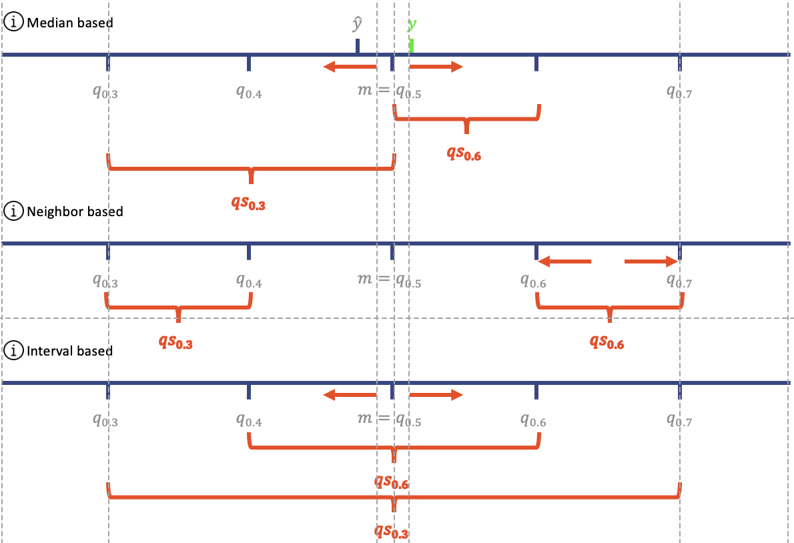

<!-- here classes for second slide -->

```{r, child="xaringan-setup.Rmd", echo=FALSE}

```

```{r, include=FALSE}
devtools::load_all(".")
library(dplyr)
library(patchwork)

# cache chunks that take a long time
cache <- FALSE

uk_cqr <- readr::read_rds(here::here("data_results", "uk_cqr.rds"))
hub_1 <- readr::read_rds(here::here("data_results", "hub_cqr_1.rds"))
hub_2 <- readr::read_rds(here::here("data_results", "hub_cqr_2.rds"))
hub_cqr <- dplyr::bind_rows(hub_1, hub_2)

uk_cqr_qsa_ensemble <- readr::read_rds(
  here::here("data_results", "uk_cqr_qsa_uniform_ensemble.rds")
)
hub_cqr_qsa_ensemble <- readr::read_rds(
  here::here("data_results", "hub_cqr_qsa_uniform_ensemble_subset.rds")
)

# helper functions to round values in data frame for nicer display in slides
round_output <- function(df, digits) {
  df |> mutate(across(.cols = where(is.numeric), .fns = ~ round(.x, digits)))
}

display_table <- function(df, digits = 3, align = "left") {
  df |>
    round_output(digits = digits) |>
    gt::gt() |>
    gt::tab_options(
      table.align = align, row.striping.include_table_body = TRUE,
      data_row.padding = gt::px(15)
    )
}
```

<!-- here content of second slide -->

## Setting

- Post-Processing Covid19 forecasts: Systematically adjust existing prediction intervals with the goal of better out-of-sample performance

--

- Original forecasts from two data sources: The **UK Covid-19 Crowd Forecasting Challenge**<sup>1</sup> (includes forecasts of non-expert individuals) and the **European Forecast Hub**<sup>2</sup> (forecasts from international research groups)

.footnote[ 
[1] https://www.crowdforecastr.org/2021/05/11/uk-challenge/ <br>
[2] https://covid19forecasthub.eu/index.html
]

--

- The Quality of prediction intervals is measured by the **Weighted Interval Score** based on a trade-off between interval coverage and precision  

---
class: inverse, center, middle

# Conformalized Quantile Regression (CQR)

---

```{r, echo=FALSE, fig.height=5}
plot_intervals(
  uk_cqr,
  model = "seabbs", target_type = "Cases", horizon = 3, quantile = 0.1
)
```

---

## CQR for UK Data

.left-30[ 
- Hypotheses: For most models (particular by individual humans) CQR makes the prediction intervals **wider** increasing the coverage at the cost of precision

- Often leads to improvement of Weighted Interval Score
]

--

.right-65[

For this specific covariate combination:

```{r, echo=FALSE}
uk_cqr |>
  extract_validation_set() |>
  scoringutils::score() |>
  scoringutils::summarise_scores(by = c("method", "model", "target_type", "horizon", "quantile")) |>
  dplyr::filter(model == "seabbs", target_type == "Cases", horizon == 3, quantile == 0.1) |>
  dplyr::select(method:dispersion) |>
  display_table()
```

Aggregated over all **models**, **target types**, **horizons** and **quantiles**:

```{r, echo=FALSE}
uk_cqr |>
  extract_validation_set() |>
  scoringutils::score() |>
  scoringutils::summarise_scores(by = c("method")) |>
  dplyr::select(method:dispersion) |>
  display_table()
```

]

---

## Evaluation

- Apart from the absolute Interval Score change the **relative** or **percentage** change after applying CQR might be of interest

--

- New evaluation functions: **eval_methods()** and **plot_eval()**   

--

- Negative values indicate a score improvement, positive values a larger/worse interval score

--

- All displayed values are computed exclusively from the **validation** (out-of-sample) data 

---

## Which model benefits most?

.pull-left[ 

```{r}
eval_methods(uk_cqr, summarise_by = "model") |>
  display_table()
```

]

--

.pull-right[ 

- For many categories the magnitudes of the relative change is difficult to compare in the table output

- Visualize table either as barplot or heatmap

- Focus on models that participated regularly in the UK Forecasting Challenge

]

---

```{r uk-cqr-plots1, echo=FALSE, fig.height=5, cache=cache}
df_eval <- eval_methods(uk_cqr, summarise_by = "model")

p1 <- plot_eval(df_eval, heatmap = FALSE, base_size = 8) +
  ggplot2::labs(y = NULL) +
  ggplot2::labs(title = "CQR Improvements by Model")
p2 <- plot_eval(df_eval, base_size = 8) +
  ggplot2::labs(y = NULL) +
  ggplot2::labs(title = "CQR Improvements by Model")

p1 + p2
```

---

```{r uk-cqr-plots2, echo=FALSE, fig.height=5, cache=cache}
df_mod_quant <- eval_methods(uk_cqr, summarise_by = c("model", "quantile"))

b <- "black"
t <- "transparent"

p1 <- plot_eval(df_mod_quant, base_size = 8) +
  ggplot2::labs(
    y = NULL,
    title = "CQR Improvements by Model and Quantile",
    subtitle = NULL
  ) +
  ggplot2::theme(
    # 'hack' to display only every second label on x - axis
    axis.text.x = ggplot2::element_text(color = c(b, rep(c(t, b), 11)))
  )

df_mod_hor <- eval_methods(uk_cqr, summarise_by = c("model", "horizon"))
p2 <- plot_eval(df_mod_hor, base_size = 8) +
  ggplot2::labs(
    y = NULL, title = "CQR Improvements by Model and Horizon",
    subtitle = NULL
  )

p1 + p2
```

---

## CQR for European Forecast Hub Data

- We selected $18$ European countries to conduct the analysis

--

- Several interesting questions to investigate:

--

- Do CQR improvements vary across countries?

--

- Do the findings from the much smaller UK Data Set generalize?

--

- For Germany CQR tends to extend original forecast intervals for **Cases** as before but decrease their width for **Deaths**  

---

```{r, echo=FALSE, fig.height=5}
plot_intervals_grid(hub_cqr, model = "EuroCOVIDhub-ensemble", location = "DE", quantiles = 0.1)
```

---

## What's wrong with Poland?

.left-65[ 

```{r hub-cqr-all, echo=FALSE, fig.height=5, cache=cache}
df_mod_loc <- eval_methods(hub_cqr, summarise_by = c("model", "location"))
plot_eval(df_mod_loc) + ggplot2::labs(y = NULL)
```

]

.right-30[ 

- Visualization is dominated by the very large negative impact of CQR on Poland

- Have to exclude Poland to gain further insight about the remaining countries

- First, let's figure out why Poland is such an outlier

]

---

.pull-left[ 

## Training Set

```{r hub-cqr-poland-1, echo=FALSE, cache=cache}
cqr_poland <- hub_cqr |>
  dplyr::filter(location_name == "Poland")

cqr_poland |>
  extract_training_set() |>
  scoringutils::score() |>
  scoringutils::summarise_scores(by = c("method", "model")) |>
  dplyr::arrange(model) |>
  dplyr::select(method:dispersion) |>
  dplyr::slice_head(n = 6) |>
  display_table()
```

]

--

.pull-right[ 

## Validation Set

```{r hub-cqr-poland-2, echo=FALSE, cache=cache}
cqr_poland |>
  extract_validation_set() |>
  scoringutils::score() |>
  scoringutils::summarise_scores(by = c("method", "model")) |>
  dplyr::arrange(model) |>
  dplyr::select(method:dispersion) |>
  dplyr::slice_head(n = 6) |>
  display_table()
```

]

--

<br>

Hypothesis: **Distribution Shift** between training period and validation period!

---

```{r hub-cqr-poland-3, echo=FALSE, fig.height=5, cache=cache}
p1 <- cqr_poland |>
  plot_intervals(model = "IEM_Health-CovidProject", target_type = "Cases", base_size = 8)

p2 <- hub_cqr |>
  dplyr::filter(location == "DE") |>
  plot_intervals(model = "IEM_Health-CovidProject", target_type = "Cases", base_size = 8)

p1 + p2
```

---

## Findings for European Forecast Hub

- As a final step, we exclude Poland and analyze CQR improvements for each combination of country with either **model**, **horizon**, **target type** and **quantile**   

--

- Largest relative performance boost for **USC-SIkJalpha** model from a research group of the University of California

--

- Recall that in the UK Data Set CQR improved interval scores most for **large forecast horizons**, **quantiles in the tails** of the predictive distribution and **Cases** instead of Deaths

--

- Same trends exist for the European Hub Data, although to a much more moderate degree

---

```{r hub-cqr-no-poland-1, echo=FALSE, fig.height=5, cache=cache}
cqr_no_poland <- hub_cqr |>
  dplyr::filter(location_name != "Poland")

df_mod_loc <- eval_methods(cqr_no_poland, summarise_by = c("model", "location"))
p1 <- plot_eval(df_mod_loc, base_size = 8) +
  ggplot2::labs(
    x = NULL, y = NULL, title = "CQR Improvements by Model and Location",
    subtitle = NULL
  )

df_hor_loc <- eval_methods(cqr_no_poland, summarise_by = c("horizon", "location"))
p2 <- plot_eval(df_hor_loc, base_size = 8) +
  ggplot2::labs(
    x = NULL, title = "CQR Improvements by Horizon and Location",
    subtitle = NULL
  )

p1 + p2
```

---

```{r hub-cqr-no-poland-2, echo=FALSE, fig.height=5, cache=cache}
df_quant_loc <- eval_methods(cqr_no_poland, summarise_by = c("quantile", "location"))
p1 <- plot_eval(df_quant_loc, base_size = 8) +
  ggplot2::labs(
    x = NULL, title = "CQR Improvements by Quantile and Location",
    subtitle = NULL
  )

df_target_loc <- eval_methods(cqr_no_poland, summarise_by = c("target_type", "location"))
p2 <- plot_eval(df_target_loc, base_size = 8) +
  ggplot2::labs(
    x = NULL, y = NULL, title = "CQR Improvements by Target Type and Location",
    subtitle = NULL
  )

p1 + p2
```

---
class: inverse, center, middle

# Quantile Spread Averaging (QSA)

---

## QSA - Intuition

.left-30[ 
- Define quantile spreads median based

- Alternatives are neighbor or symmetry based

- Avantages of Median basis: spreads independent of quantile number and non-symmetric adjustments possible

- Risks: quantile cutting 

]

.right-65[ 


]

---

## QSA - Theory 

Let $n$ specify the number of observations in the training set within this combination, $\mathbf{y} \in \mathbb{R}^n$ the vector of true values and $\hat{\mathbf{q}}_1, \ldots, \hat{\mathbf{q}}_p \in \mathbb{R}^n$ vectors of quantile estimates for $p$ different probability levels.

--

Then, for each time series, the quantile spread adjustment computes the quantile spread factors $\mathbf{f}^* \in R^p$ by minimizing the weighted interval score:
$$
\begin{aligned}
\mathbf{f}^*
&= \operatorname*{arg\,min}_{ \mathbf{f} \in R^p} Score_\alpha(\mathbf{y}) \\
&= \operatorname*{arg\,min}_{ \mathbf{f} \in R^p} \sum_{i=1}^p \sum_{j=1}^n (u_{i,j}^*-l_{i,j}^*) + \frac{2}{\alpha} \cdot (l_{i,j}^*-y_j) \cdot \mathbf{1} (y_j \leq l_{i,j}^*) + \frac{2}{\alpha} \cdot (y_j-u_{i,j}^*) \cdot \mathbf{1}(y_j \geq u_{i,j}^*) \\
\text{s.t.} \qquad l_{i,j}^* &= l_{i,j} + (l_{i,j}-m) * f_i \quad \text{and} \quad 
u_{i,j}^* = u_{i,j} + (m-u_{i,j}) * f_i 
\end{aligned}
$$

--

The optimization uses the **optim** function from the **stats**<sup>1</sup> package. 
As optimization method we use the quasi-Newton method **BFGS** named after Broyden, Fletcher, Goldfarb and Shanno.

<!-- read in preparation: https://en.wikipedia.org/wiki/Broyden–Fletcher–Goldfarb–Shanno_algorithm and find reference to the paper for footnotes. -->

.footnote[ 
https://www.rdocumentation.org/packages/stats/versions/3.6.2/topics/optim
]

---

## QSA - Flavors and Extensions 

Postforecast offers three flavors of QSA where each restricts $\mathbf{f}^*$ differently:
- uniform: $i \in [0, 1, \ldots, p-1, p] \quad f_i = c$
- flexibel: $none$
- flexibel-symmetric: $i \in [0, 1, \ldots, m-1] \quad f_i = f_{p-i}$

Furthermore, postforecast provides regularization towards QSA uniform by adding a regularization term $Pen(\mathbf{f})$ with the weight $r$ to the score function: 

$$
\begin{aligned}
\mathbf{f}^*
&= \operatorname*{arg\,min}_{\mathbf{f} \in R^p} \ Score_\alpha(\mathbf{y}) + r * Pen(\mathbf{f}), \quad Pen(\mathbf{f}) = \sum_{i=1}^p (f_i - \bar{f})^2 \\
\text{s.t.} \qquad \bar{f} &= \frac{1}{p} \sum_{i=1}^p f_i
\end{aligned}
$$

---

```{r, echo=FALSE}
uk_qsa_uniform <- readr::read_rds(here::here("data_results", "uk_cqr_qsa_uniform_ensemble.rds")) |> dplyr::filter( method %in%  c("original", "qsa_uniform"))
```

```{r uk-qsa-plots1, echo=FALSE}
plot_intervals_grid(
  uk_qsa_uniform,
  model = "seabbs", quantile = 0.1, facet_by = "horizon"
)
```

---

## QSA for thte UK Dataset

.left-30[ 
- Does QSA improve the Weighted Interval Score? 

- What adjustments to the prediction intervals does it make?

- Is there any pattern visible in QSA adjustments across models?

]

--

.right-65[

.pull-left[

Aggregated results:

```{r, echo=FALSE}
uk_qsa_uniform |>
  extract_validation_set() |>
  scoringutils::score() |>
  scoringutils::summarise_scores(by = c("method")) |>
  dplyr::select(method:dispersion) |>
  display_table()
```

]

.pull-right[

Unraveled by **models**:

```{r, echo=FALSE}
eval_methods(uk_qsa_uniform, summarise_by = "model") |>
  display_table()
```
]

]

---
<!-- ## How are improvements distributed around quantiles and horizons? -->

```{r uk-qsa-plots2, echo=FALSE, fig.height=5, cache=cache}
df_mod_quant <- eval_methods(uk_qsa_uniform, summarise_by = c("model", "quantile"))

b <- "black"
t <- "transparent"

p1 <- plot_eval(df_mod_quant, base_size = 8) +
  ggplot2::labs(
    y = NULL,
    title = "QSA Improvements by Model and Quantile",
    subtitle = NULL
  ) +
  ggplot2::theme(
    # 'hack' to display only every second label on x - axis
    axis.text.x = ggplot2::element_text(color = c(b, rep(c(t, b), 11)))
  )

df_mod_hor <- eval_methods(uk_cqr, summarise_by = c("model", "horizon"))
p2 <- plot_eval(df_mod_hor, base_size = 8) +
  ggplot2::labs(
    y = NULL, title = "QSA Improvements by Model and Horizon",
    subtitle = NULL
  )

p1 + p2
```

---

## QSA for European Forecast Hub Data

- Can we replicate QSA benefits across countries?

--

- Due to run time restrictions we restrict our analysis to the **Epiforecasts-EpiNow2** model and the target type **Cases**

--

- For Germany QSA tends to extend original forecast intervals for **Cases** as seen in the UK data:

```{r hub-qsa-plots1, echo=FALSE, fig.height=2.7, cache=cache}
hub_qsa_uniform <- readr::read_rds(here::here("data_results", "hub_cqr_qsa_uniform_ensemble_subset.rds")) |> dplyr::filter( method %in%  c("original", "qsa_uniform"))


plot_intervals_grid(hub_qsa_uniform, model = "epiforecasts-EpiNow2", location = "DE", quantiles = 0.1) +
  ggplot2::labs(
    y = NULL,
    title = "CQR Improvements in Germany",
    subtitle = NULL
  )
```

---

<!-- ## how are the benefits distributed around countries as well as around quantiles and horizons? 

- no poland issue indicates that QSA adjusts faster to new distributions
-->

```{r hub-qsa-plots2, echo=FALSE, fig.height=5, cache=cache}
df_mod_loc <- eval_methods(hub_qsa_uniform, summarise_by = c("location_name"))

b <- "black"
t <- "transparent"

plot_eval(df_mod_loc, heatmap = FALSE) +
  ggplot2::labs(
    y = NULL,
    title = "CQR Improvements by Country",
    subtitle = NULL
  ) +
  ggplot2::theme(
    # 'hack' to display only every second label on x - axis
    axis.text.x = ggplot2::element_text(color = c(b, rep(c(t, b), 11)))
  )

df_mod_quant <- eval_methods(hub_qsa_uniform, summarise_by = c("horizon", "quantile"))
p1 <- plot_eval(df_mod_quant, base_size = 8) +
  ggplot2::labs(
    y = NULL, title = "QSA Improvements by Horizon and Quantile",
    subtitle = NULL
  )

p1 + p2
```

---

## Where might the issue lie?

- QSA Unifrom might not be well suited to improve predictions form the **Epiforecasts-EpiNow2** model

--

- QSA Uniform could not be flexible enough if different quantiles need different relativ adjustments

--

- Requires further analysis of QSA on different models and using the fleixbel and symmetric flavors


---
class: inverse, center, middle

# Ensemble Model

---

## Ensemble - Idea

- Find the best **convex combination** of post-processed predictions that minimizes the sum of squared residuals 

--

- Averages of independent prediction algorithms often lead to better performance than each individual predictor

---

## Ensemble - Exact Formulation

Consider one particular covariate combination of **model**, **location**, **horizon**, **target type** and **quantile**.

--

Let $n$ specify the number of observations in the training set within this combination, $\mathbf{y} \in \mathbb{R}^n$ the vector of true values and $\hat{\mathbf{y}}_1, \ldots, \hat{\mathbf{y}}_k \in \mathbb{R}^n$ vectors of adjusted predictions from $k$ different post-processing procedures.

--

Then, for each such combination, the ensemble model computes weights $\mathbf{w}^* \in [0, 1]^k$ (technically $\mathbf{w}_{m, l, h, t, q}^*$) by solving the following constrained optimization problem:
$$
\begin{aligned}
\mathbf{w}^*
= \operatorname*{arg\,min}_{ \mathbf{w} \in [0, 1]^k} \left \Vert \mathbf{y} - \sum_{j=1}^{k} w_j \hat{\mathbf{y}}_j \right \Vert_2^2
&= \operatorname*{arg\,min}_{ \mathbf{w} \in [0, 1]^k} \sum_{i=1}^{n} \left(y_i - \sum_{j=1}^{k} w_j \hat{y}_{ij} \right)^2 \\
\text{s.t.} \qquad \sum_{j=1}^{k} w_j &= 1
\end{aligned}
$$
---

## Ensemble - Exact Formulation

Since we only consider the **CQR** and **QSA Uniform** methods in this case, the minimization objective above simplifies to
$$
\begin{aligned}
\mathbf{w}^*
= \begin{pmatrix} w_1^* & w_2^* \end{pmatrix}^T
= \operatorname*{arg\,min}_{w_1, w_2 \in [0, 1]} \sum_{i=1}^{n} \left(y_i - w_1 cqr_i - w_2 qsa_i \right)^2.
\end{aligned}
$$
--

The optimization is implemented with the **quadprog**<sup>1</sup> package which can also be used for more general quadratic programming problems.

.footnote[ 
https://cran.r-project.org/web/packages/quadprog/index.html
]

---

## Comparison of CQR, QSA and Ensemble Results

- We start with UK Data

--

- Nature of adjustments majorly depends on covariate combination

--

- First example with **epiforecasts-EpiExpert** model: Overall only small corrections of original forecasts

--

- Here, CQR makes intervals larger while QSA makes them **smaller**

--

- However, neither of the methods improve the weighted interval score

```{r, echo=FALSE}
uk_cqr_qsa <- uk_cqr_qsa_ensemble |> dplyr::filter(method != "ensemble")

uk_cqr_qsa |>
  extract_validation_set() |>
  scoringutils::score() |>
  scoringutils::summarise_scores(by = c("method", "model", "target_type", "horizon", "quantile")) |>
  dplyr::filter(model == "epiforecasts-EpiExpert", target_type == "Cases", horizon == 1, quantile == 0.1) |>
  dplyr::select(method:dispersion) |>
  dplyr::arrange(interval_score) |>
  display_table(align = "center")
```

---

```{r, echo=FALSE, fig.height=5}
plot_intervals(
  uk_cqr_qsa,
  model = "epiforecasts-EpiExpert", target_type = "Cases", horizon = 1, quantile = 0.1
)
```

---

## Comparison of CQR, QSA and Ensemble Results

- Second Example with **seabbs** model: Both methods produce much larger intervals

--

- CQR intervals are centered around the original median prediction, this is not the case for QSA!

--

- Thus, CQR and QSA intervals can have equal length but they are **shifted** in space

--

- In this example both models improve interval score a lot, however QSA effect is much stronger 

```{r, echo=FALSE}
uk_cqr_qsa |>
  extract_validation_set() |>
  scoringutils::score() |>
  scoringutils::summarise_scores(by = c("method", "model", "target_type", "horizon", "quantile")) |>
  dplyr::filter(model == "seabbs", target_type == "Cases", horizon == 3, quantile == 0.05) |>
  dplyr::select(method:dispersion) |>
  dplyr::arrange(interval_score) |>
  display_table(align = "center")
```

---

```{r, echo=FALSE, fig.height=5}
plot_intervals(
  uk_cqr_qsa,
  model = "seabbs", target_type = "Cases", horizon = 3, quantile = 0.05
)
```

---

## Comparison by Category

- When stratified by a single category the overall performance of **QSA is better than CQR**

--

- Hence the ensemble predictions are pulled towards the QSA forecasts

--

- Except for splitting by quantiles the **ensemble model performs best** on the UK Data

---

```{r, echo=FALSE, fig.height=5}
df_mod <- eval_methods(uk_cqr_qsa_ensemble, summarise_by = "model")
df_target <- eval_methods(uk_cqr_qsa_ensemble, summarise_by = "target_type")

p1 <- plot_eval(df_mod, base_size = 8) + ggplot2::labs(
  y = NULL,
  title = "Performance Comparison by Model",
  subtitle = NULL
)

p2 <- plot_eval(df_target, base_size = 8) + ggplot2::labs(
  y = NULL,
  title = "Performance Comparison by Target Type",
  subtitle = NULL
)

p1 + p2
```

---

```{r, echo=FALSE, fig.height=5}
df_hor <- eval_methods(uk_cqr_qsa_ensemble, summarise_by = "horizon")
df_quant <- eval_methods(uk_cqr_qsa_ensemble, summarise_by = "quantile")

p3 <- plot_eval(df_hor, base_size = 8) + ggplot2::labs(
  title = "Performance Comparison by Horizon",
  subtitle = NULL
)

p4 <- plot_eval(df_quant, base_size = 8) + ggplot2::labs(
  title = "Performance Comparison by Quantile",
  subtitle = NULL
)

p3 + p4
```

---

## Comparison on EU Forecast Hub Data

- Most interesting question: How do the methods compare across the countries?

--

- Result: Absolute **magnitude** of relative changes is greater for QSA (both positive and negative)

--

- Effects are more diverse than for UK Data, hence the **ensemble model outperforms the individual methods**

--

- CQR and QSA increase overall dispersion, yet the interval score is **only improved by CQR** in this case

```{r, echo=FALSE}
hub_cqr_qsa_ensemble |>
  extract_validation_set() |>
  scoringutils::score() |>
  scoringutils::summarise_scores(by = c("method")) |>
  dplyr::select(method:dispersion) |>
  dplyr::arrange(interval_score) |>
  display_table(align = "center")
```

---

```{r, echo=FALSE, fig.height=5}
df_loc <- eval_methods(
  hub_cqr_qsa_ensemble |> dplyr::filter(!location %in% c("PL", "FI")),
  summarise_by = "location_name"
)

plot_eval(df_loc) + ggplot2::labs(
  y = NULL, 
  title = "Performance Comparison by Location",
  subtitle = NULL
)
```

---
class: center, middle, inverse

# Outlook

---

## More Methods

- Stable package infrastructure that generalizes well to further Post-Processing methods 

--

- Candidate methods: **Quantile Regression Averaging** and **modified** versions of CQR 

--

- Comprehensive analysis of strength and weaknesses of each method across the full datasets

---

## References

**Traditional CQR Method**

Romano Y., Patterson E., and Candès E. (2019). Conformalized Quantile Regression. *NeurIPS Annual Conference on Neural Information Processing Systems*.
  - Paper: https://proceedings.neurips.cc/paper/2019/file/5103c3584b063c431bd1268e9b5e76fb-Paper.pdf
  
  - Poster: https://github.com/yromano/cqr/blob/master/poster/CQR_Poster.pdf

<br>

**Variations and Extensions of CQR**

Tibshirani R. (2019). Advances and Challenges in Conformal Inference. *Carnegie Mellon University*.
  - Slides: .underline[www.stat.cmu.edu/~ryantibs/talks/conformal-2019.pdf]

---

## References

**More Information about the UK Covid-19 Forecasting Challenge**

- Website: https://www.crowdforecastr.org/2021/05/11/uk-challenge/

- Evaluation & Ranking: https://epiforecasts.io/uk-challenge/

<br>

**More Information about the European Forecasting Hub**

- Website: https://covid19forecasthub.eu/index.html

- GitHub: https://github.com/epiforecasts/covid19-forecast-hub-europe
